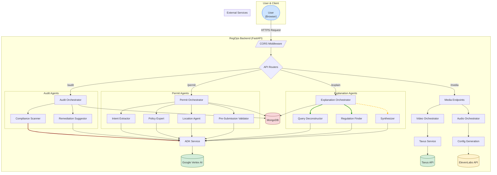
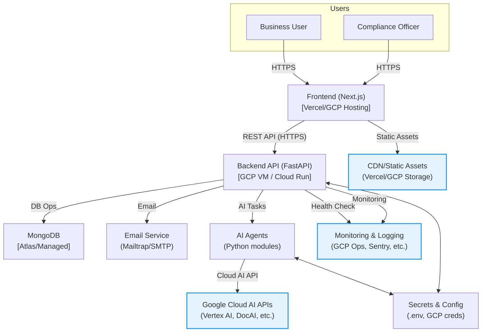

# RegOps AI Suite Backend

## Overview
The backend for the RegOps AI Suite is an intelligent, multi-agent system built on FastAPI. It leverages a clean architecture to provide robust, scalable, and maintainable services for AI-powered compliance automation. The system includes modular orchestrators for complex tasks like permit analysis, compliance audits, and generating regulatory explanations.

---

## Key Features
- **Authentication & Authorization**: Secure JWT-based auth with email verification.
- **Multi-Agent Orchestrators**: Dedicated orchestrators for `Permit`, `Audit`, and `Explanation` tasks, managing chains of specialized AI agents.
- **Conversational Media Endpoints**:
  - **Tavus Integration**: Generates real-time, context-aware conversational video sessions.
  - **ElevenLabs Integration**: Provides configuration for real-time, conversational audio sessions.
- **Centralized Routing**: All API routes are managed directly in `main.py` for clarity.
- **Singleton MongoDB Client**: Efficiently managed in `infrastructure/db.py`.
- **Comprehensive OpenAPI Docs**: Automatically generated and secured via JWT.

---

## Architecture Diagram

The diagram below illustrates the multi-agent architecture of the RegOps backend, including the flow of requests from the user through the API endpoints to the various orchestrators and external services.



---

## Setup

1.  **Clone the repo** and navigate to the `regops/api` directory.
2.  **Create and activate a virtual environment**:
    ```bash
    python -m venv env
    source env/bin/activate  # Or `env\Scripts\activate` on Windows
    ```
3.  **Install dependencies**:
    ```bash
    pip install -r requirements.txt
    ```
4.  **Create a `.env` file** in the `regops/api` directory. Populate it with your credentials.
    ```env
    # General
    ENV=development
    DEBUG=True
    PORT=8000
    SECRET_KEY=your-super-secret-key
    BACKEND_CORS_ORIGINS=http://localhost:3000,http://localhost:8000

    # Database
    MONGODB_URL=mongodb://localhost:27017
    DATABASE_NAME=regops

    # Google Cloud
    GCP_PROJECT_ID=your-gcp-project-id
    GOOGLE_APPLICATION_CREDENTIALS=/path/to/your/gcp-credentials.json

    # Media Services
    TAVUS_API_KEY=your_tavus_api_key
    TAVUS_REPLICA_ID=your_tavus_replica_id
    ELEVENLABS_API_KEY=your_elevenlabs_api_key
    ELEVENLABS_AGENT_ID=your_elevenlabs_agent_id
    ```
5.  **Run the application**:
    ```bash
    uvicorn app.main:app --reload
    ```

---

## API Usage

Access the interactive API documentation at [http://localhost:8000/docs](http://localhost:8000/docs).

### Media Endpoints

These endpoints provide configurations for starting real-time conversational media sessions.

#### Start Video Conversation

-   `POST /api/v1/media/video/start_conversation`
-   **Description**: Takes permit details and returns a unique Tavus URL for a real-time video call with a context-aware AI avatar.
-   **Request Body**:
    ```json
    {
      "permit_details": {
        "applicant_name": "EcoBuild Corp",
        "project_type": "New Commercial Building",
        "status": "Pending Review"
      }
    }
    ```
-   **Success Response (200)**:
    ```json
    {
      "conversation_url": "https://tavus.daily.co/c123456..."
    }
    ```

#### Get Audio Conversation Config

-   `POST /api/v1/media/audio/start_conversation`
-   **Description**: Takes permit details and returns the necessary configuration for a client to establish a WebSocket connection with a context-aware ElevenLabs audio agent.
-   **Request Body**:
    ```json
    {
      "permit_details": {
        "applicant_name": "EcoBuild Corp",
        "project_type": "New Commercial Building",
        "status": "Pending Review"
      }
    }
    ```
-   **Success Response (200)**:
    ```json
    {
      "agent_id": "your_elevenlabs_agent_id",
      "prompt": "You are an expert AI assistant for RegOps... Here is the permit information: ..."
    }
    ```

---

## Project Structure
```
regops/api/
├── app/
│   ├── api/
│   │   └── v1/
│   │       └── endpoints/
│   │           ├── auth.py
│   │           └── health.py
│   ├── core/
│   │   └── config.py
│   ├── domain/
│   │   ├── models/
│   │   │   └── user.py
│   │   └── schemas/
│   │       └── auth.py
│   ├── infrastructure/
│   │   └── db.py
│   ├── services/
│   │   ├── auth_service.py
│   │   └── email_service.py
│   ├── templates/
│   │   ├── verification_email.html
│   │   └── password_setup.html
│   └── main.py
├── requirements.txt
└── README.md
```

---

## Clean Code & Architecture Notes
- **main.py**: Only handles app wiring, middleware, router inclusion, and event hooks
- **infrastructure/db.py**: Manages MongoDB client lifecycle and exposes `get_db` dependency
- **services/**: Business logic (auth, email)
- **domain/**: Pydantic models and schemas
- **api/v1/endpoints/**: All API routes, modular and versioned
- **No business or DB logic in main.py**
- **All config from `.env`**

---

## Health Endpoint Example
```json
{
  "status": "ok",
  "database": "ok"
}
```
If the database is unreachable:
```json
{
  "status": "ok",
  "database": "unreachable"
}
```

---

## Troubleshooting
- If health check says `database: unreachable`, ensure MongoDB is running and accessible from your app environment (see README for WSL/Windows tips).
- Always specify `--port` with Uvicorn if you want to override the default 8000.
- All email is sent via Mailtrap API (no SMTP setup required).

---

## Contributing
- Fork, branch, PR. Follow clean code and modularity guidelines.

## Architecture Diagram

Below is the architecture for the RegOps AI Suite. You can copy this Mermaid code into any Mermaid-compatible markdown viewer or the [Mermaid Live Editor](https://mermaid.live) to visualize and download the diagram.



**How it works:**
- Users interact with the Next.js frontend, which communicates with the FastAPI backend via secure REST APIs.
- The backend handles business logic, authentication, and orchestrates AI agents for compliance tasks.
- MongoDB stores all persistent data.
- Email notifications are sent via Mailtrap or SMTP.
- AI agents interact with Google Cloud AI APIs for advanced document and language processing.
- All secrets and configuration are managed securely.
- Monitoring and health checks are integrated for observability.
- Static assets are served via CDN for fast, global access. 